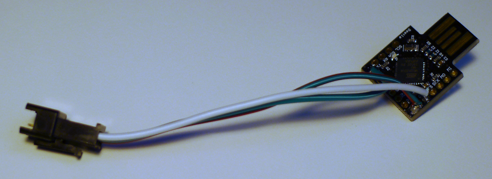
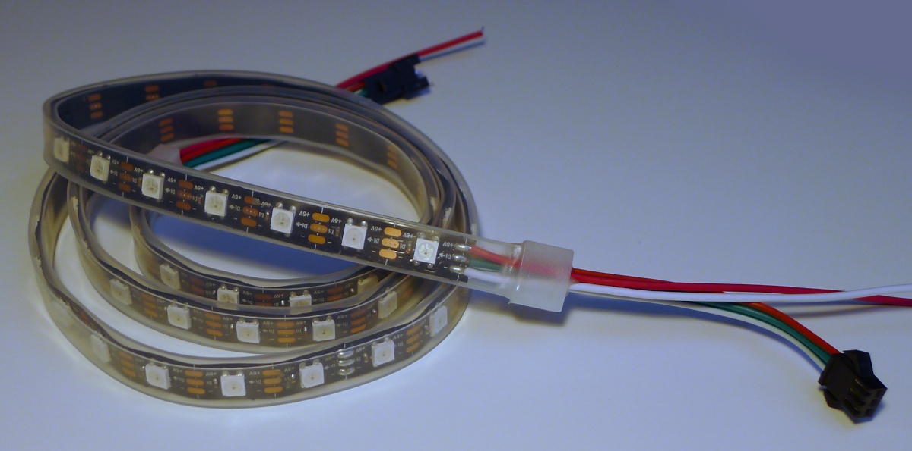

<a href="#"></a>
# **VK** Monitor Backlight - Controller


A [PlatformIO](https://platformio.org/) project for [Arduinos](https://www.arduino.cc/) to convert the serial input and drive a strip of [WS2812](https://cdn-shop.adafruit.com/datasheets/WS2812.pdf) leds.


| Controller | LEDs |
|:-:|:-:|
| [](../media/controller.png "Controller") | [](../media/ledstrip.png "LEDs") |


##  Build
Install [PlatformIO](https://platformio.org/) for VsCode or your favorite IDE.
```
platformio run --target upload
```